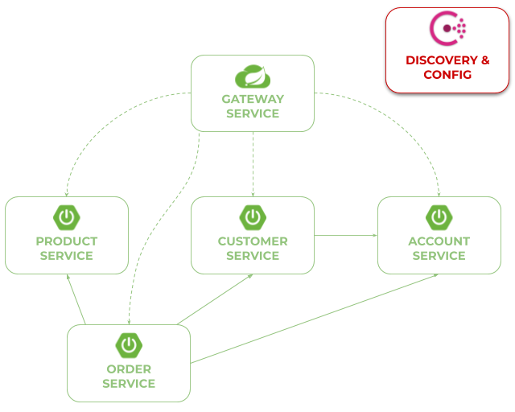
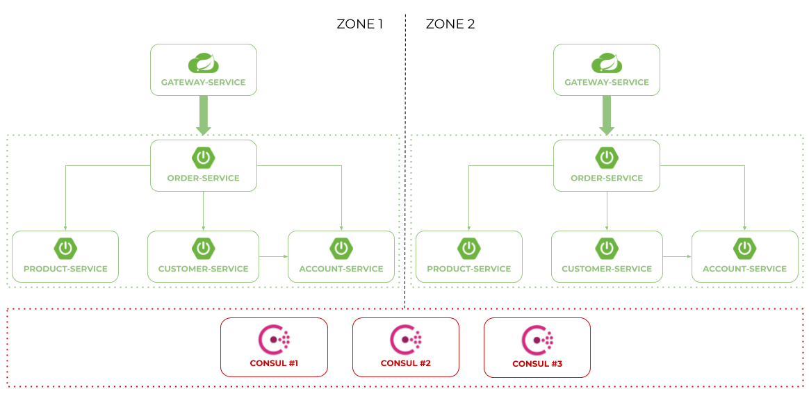
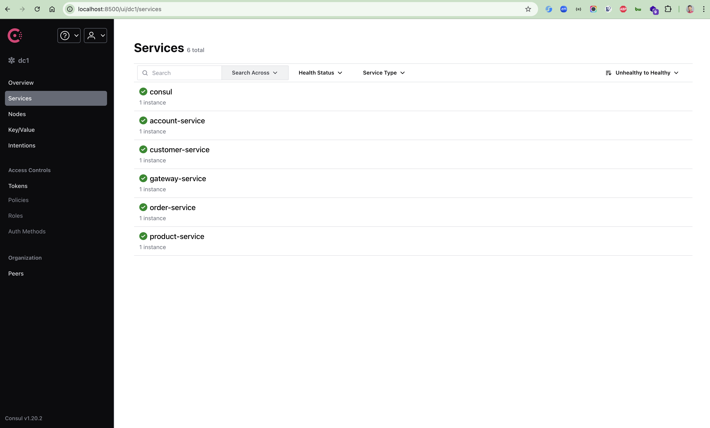

# Spring Cloud Consul Sample

In this project I'm demonstrating you how to use Hashicorp's **Consul** as a discovery and configuration server
with [Spring Cloud Consul](https://spring.io/projects/spring-cloud-consul) and other Spring Cloud projects for building
microservice-based architecture.

## Getting Started

1. To build and run sample applications you need to have Maven, JDK21+ and Docker. However, the simplest way to start
   with it is through any IDE like IntelliJ IDEA or Eclipse.
2. First, you have to run Consul on Docker container

```
$ docker run -d --name consul-1 -p 8500:8500 -e CONSUL_BIND_INTERFACE=eth0 consul
```

3. Then you can compile your application with Maven `mvn clean install` command and using `java -jar ...` command. Or
   you can just build it and run using your IDE. Each application is listening on dynamically generated port.

## Architecture

Our sample microservices-based system consists of the following modules:

- **gateway-service** - a module that uses Spring Cloud Gateway for running Spring Boot application that acts as a
  proxy/gateway in our architecture.
- **account-service** - a module containing the first of our sample microservices that allows to perform CRUD operation
  on in-memory repository of accounts
- **customer-service** - a module containing the second of our sample microservices that allows to perform CRUD
  operation on in-memory repository of customers. It communicates with account-service.
- **product-service** - a module containing the third of our sample microservices that allows to perform CRUD operation
  on in-memory repository of products.
- **order-service** - a module containing the fourth of our sample microservices that allows to perform CRUD operation
  on in-memory repository of orders. It communicates with all other microservices.

The following picture illustrates the architecture described above.



When running sample applications we can test more advanced scenario. We may leverage **Zone Affinity** mechanism to
prefer communication inside a single zone. We can also start a cluster of Consul modes started locally on Docker
containers. Here's the picture illustrating such an architecture:




